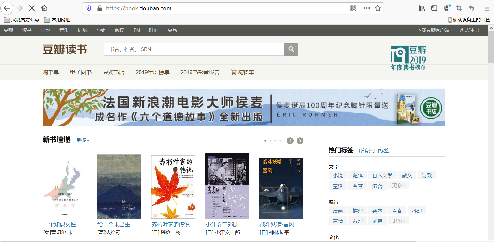
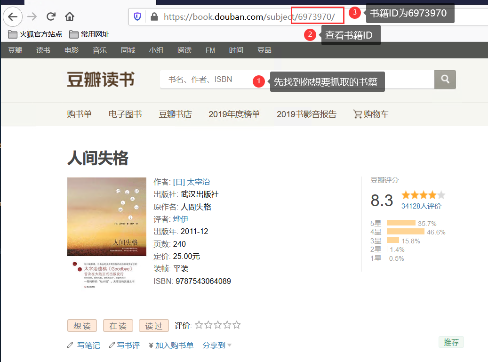
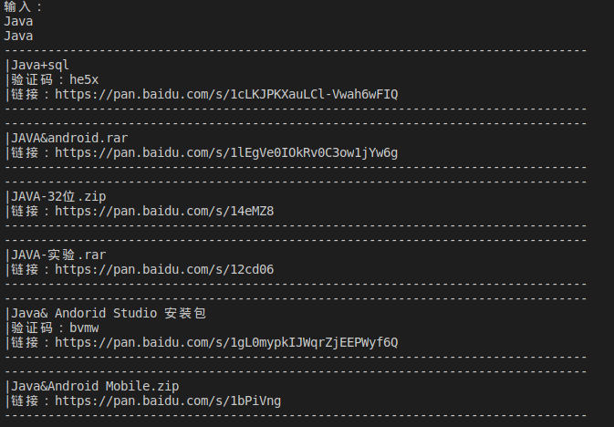
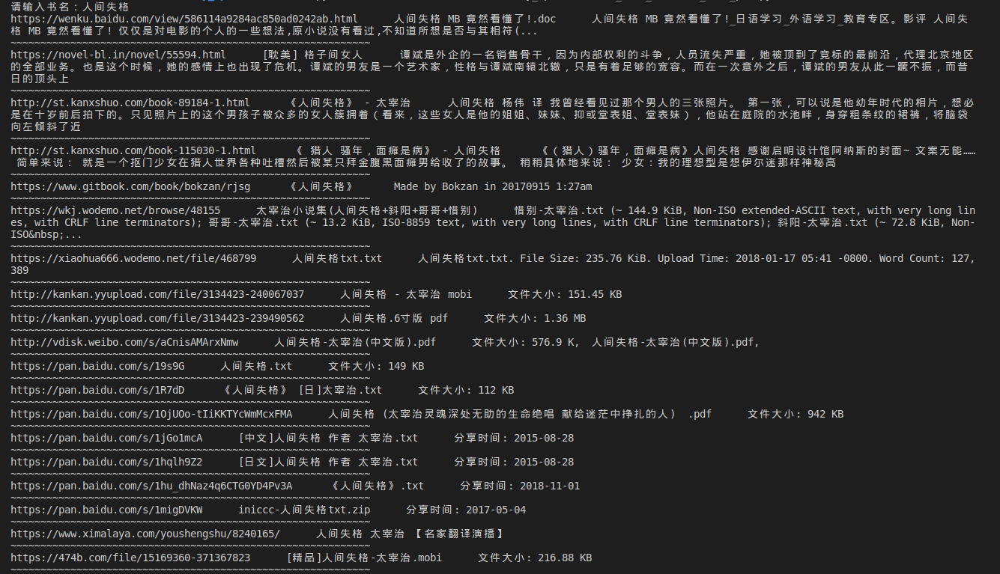

# 学习基本的网络爬虫

| 爬虫列表                                          |                                                  |                                                              |                                                              |
| ------------------------------------------------- | ------------------------------------------------ | ------------------------------------------------------------ | ------------------------------------------------------------ |
| [妹子图爬取](meizi_web_spider/spider_mm.py)       | [有道翻译](youdao_web_spider/YouDaoTranslate.py) | [当当书城畅销书排行](dangdang_web_spider/DangDangWangBook.py) | [豆瓣读书网站评论及原文摘要](douban_web_spider/DouBanBook.py) |
| [使用Scrapy的图书爬虫](book_spider/book_spider) |    [百度网盘资料搜索器](baidu_pan_spider/crawlbaidunet.py)                                              | [电子图书搜索神器](search_book_net/Find_book_pdf.py)                                                             |                                                              |
|                                                   |                                                  |                                                              |                                                              |


1. [妹子图爬取](meizi_web_spider/spider_mm.py)  
   - 在get_page_link方法中有个限制，取消后可以直接爬取全站分页，否则只能爬取全站分页的52页。
       
   - Windows系统电脑可以直接运行这个[文件](meizi_web_spider/dist/spider_mm.exe)
       
   - 加入[每日一爬](meizi_web_spider/everyday_spider_mm.py)功能(只爬取每日更新图片)
    
2. [有道翻译](youdao_web_spider/YouDaoTranslate.py)
   - 抓取移动端的有道词典，实时进行翻译
       
   - 和第一个妹子图不同的请求方式，你可以看到使用post请求返回的结果
       
   - 开始尝试使用面向对象的思路写爬虫程序
    
3. [当当书城畅销书排行](dangdang_web_spider/DangDangWangBook.py)
   - 抓取当当网站畅销书排行(ps:还是要多读书额)
     
   - 另外附赠4月25日抓取的[数据](dangdang_web_spider/当当网图书销量排行榜.txt)
     
   - 使用两种方式保存抓取到的数据
  
     - 使用txt格式时，什么都不需要做，只要运行就好
     
     - 使用MongoDB时，需要额外安装Mongo数据库和pymongo
  
   - 抓取时，使用的xpath如下：
  
        ```
        # 页码 //*[@class="data"]/span[2]/text()
        # 对应排行 //*[@class="bang_list clearfix bang_list_mode"]/li/div[1]/text()
        # 书名 //*[@class="name"]/a/@title
        # 推荐度 //*[@class="tuijian"]/text()
        # 作者 //*[@class="publisher_info"]/a[1]/@title
        # 出版社 //*[@class="publisher_info"]/a[1]/text()  ### 注意：偶数个才是出版社名
        # 价格 //*[@class="price"]/p[1]/span[1]/text()
        ```
4. [豆瓣读书网站评论及原文摘要](douban_web_spider/DouBanBook.py)

   - 抓取豆瓣网站长评论、原文摘录以及读书笔记
   
   - 此次抓取使用多线程提高了抓取速度 
   
   - 在本小项目中，由于时间较为紧迫，导致部分代码中含有较多看似相同的代码，在长评论、原文摘录以及读书笔记中最明显，原因如下：
   
     - 获取的xpath部分是相同的
   
     - 代码形体看似是相同的
   
   - 已想到的解决方法

     - 建造一个新的方法，该方法直接通过传入参数值的方式来抓取，并返回结果
   
     - 然后删减掉长评论、原文摘录以及读书笔记中部分代码，使用刚建造的方法来返回值，从而保存数据

    - 使用方法(以人间失格为例)
      - 首先进入[豆瓣读书网](https://book.douban.com/)，这是它的主页面
       

      - 通过搜索框输入想要的书名，这里输入人间失格，打开后是这个界面
       

       - 将上述界面中③的内容写入到右边括号()内
          `douban = DouBanBook()`

       - 注意：本项目支持多本书的爬取，你可以在上述括号内填入更多的书的ID，使用英文`,`隔开即可
        
       - 数据有一个简单清洗，抓取后存放在MongoDB中
         - 效果如下
           - [效果图1](douban_web_spider/img/book_content.png)
           - [效果图2](douban_web_spider/img/original.png)
           - [效果图3](douban_web_spider/img/comments.png)
           - [效果图4](douban_web_spider/img/notes.png)
   
    - 抓取时，使用的xpath和思路如下：

        ```
        # 书名  //*[@property="v:itemreviewed"]/text()
        # 原作者 //*[@id="info"]//a[1]/text()
        # 评分 //*[@property="v:average"]/text()
        # 内容简介 //*[@class="related_info"]//*[@class="intro"][1]//p[1]/text()
        # https://book.douban.com/subject/6973970

        # 原文摘录 url+/blockquotes?sort=score&start=0 进入原文摘录  
        # 文章提取地址  //*[@class="blockquote-list score bottom-line"]//li/figure/text()[1]
        # https://book.douban.com/subject/6973970/blockquotes?sort=score&start=0
        # https://book.douban.com/subject/6973970/blockquotes?sort=score&start=20
        # //*[@class="paginator"]/a[10]/text()  获取最大页码值  上述可查  每次跳转为20

        # 长评 url+/reviews?start=0 进入长评
        # 评论提取地址  //*[@class="review-list  "]//*[@class="short-content"]/text()
        # https://book.douban.com/subject/6973970/reviews?start=20
        # https://book.douban.com/subject/6973970/reviews?start=20
        # //*[@class="paginator"]/a[10]/text()  获取最大页码值  上述可查  每次跳转为20

        # 读书笔记 url+/annotation?sort=rank&start=0
        # 提取地址 //*[@class="comments by_rank"]//*[@class="short"]/span/text()
        # https://book.douban.com/subject/6973970/annotation?sort=rank&start=0
        # https://book.douban.com/subject/6973970/annotation?sort=rank&start=20
        # //*[@class="paginator"]/a[10]/text()  获取最大页码值  上述可查  每次跳转为20
        ```
5. [通用图书爬虫](book_spider/book_spider)
   
   - 使用Scrapy框架创建的一个通用网络爬虫，针对不同网站编写不同的网络爬虫,对网页的抓取，实现网页文本的本地化存储。
     - 目前已经实现的网路爬虫
     
       | 每日一文爬虫-[效果图](img/book_spider/meiriyiwen效果图.png) |69小说网-[效果图](img/book_spider/novel效果图.png) |      |      |
       | :----------- | ---- | ---- | ---- |
       |              |      |      |      |

6. [百度网盘资料搜索器](baidu_pan_spider/crawlbaidunet.py)
    - 使用关键字来搜索百度网站中共享的资源
      - 效果图   
      

7. [电子图书资料搜索器](search_book_net/Find_book_pdf.py)
      - 简单使用了一下@property装饰器，好用！
      - 未加入网站过滤，一般查看搜索后以`https://pan开头`的,效果更佳！
      - 这个也是post请求，而且返回的是json数据，具体可以看代码部分
      - 效果图   
      

## 待办事件

- 将妹子图使用面向对象的思路重构代码
- 加入更多的爬虫项目
- 适当加入一些爬虫项目中的经验